# Arsitektur Sistem DD Shoes Store — B2C E-Commerce

## Diagram Arsitektur (Mermaid)

```mermaid
flowchart TD
    %% ─── AKTOR ───────────────────────────────────────────────
    Browser["🖥️ Web Browser"]
    User["👤 User\n(Konsumen)"]
    Admin["🛡️ Admin\n(Staff/Superadmin)"]

    User -->|HTTP Request| Browser
    Admin -->|HTTP Request| Browser

    %% ─── ENTRY POINT ─────────────────────────────────────────
    Browser --> URLConf

    subgraph Django_Project ["⚙️ Django Project — ddshoes/"]

        URLConf["📍 URL Router\nddshoes/urls.py\n/ · /cart/ · /order/ · /account/ · /admin/"]

        %% ─── GLOBAL LAYOUT ───────────────────────────────────
        subgraph Templates_Global ["🖼️ Global Templates"]
            BaseHTML["base.html\n(Master Layout — Navbar, Footer, Scripts)"]
            HomeHTML["home.html"]
            AlertsHTML["alerts.html\n(Flash Messages)"]
        end

        %% ─── APP: STORE ──────────────────────────────────────
        subgraph App_Store ["📦 App: store"]
            direction TB
            StoreViews["Views\nhome · product · product_detail\nsearch · submit_review"]
            StoreModels["Models\nCategory · Brand · Product\nProductGallery · UserInterest\nReviewRating"]
            StoreTemplates["Templates\nproduct.html · product_detail.html\nnew_product_email.html"]
            StoreCtxProc["Context Processor\nmenu_links_brand"]
        end

        %% ─── APP: CART ───────────────────────────────────────
        subgraph App_Cart ["🛒 App: cart"]
            direction TB
            CartViews["Views\ncart · add_cart\nremove_cart · remove_cart_item"]
            CartModels["Models\nCart · CartItem"]
            CartTemplates["Templates\ncart.html"]
            CartCtxProc["Context Processor\ncart_count"]
        end

        %% ─── APP: ORDER ──────────────────────────────────────
        subgraph App_Order ["📋 App: order"]
            direction TB
            OrderViews["Views\ncheckout · place_order · payments\nconfirmation · my_orders\norder_complete · submit_return\napply_coupon · reset_coupon\nadmin_order_pdf\nget_cities · get_districts\nget_subdistricts · get_shipping_cost"]
            OrderModels["Models\nOrder · OrderProduct\nReturnRequest · Coupon"]
            OrderTemplates["Templates\ncheckout.html · payments.html\nconfirmation.html · my_orders.html\ninvoice_pdf.html · shipping_email.html\nsubmit_return.html"]
            OrderSignals["Signals\nhandle_loyalty_logic\nsend_shipping_notification\ncache_old_tracking_number"]
        end

        %% ─── APP: ACCOUNT ────────────────────────────────────
        subgraph App_Account ["👤 App: account"]
            direction TB
            AccountViews["Views\nlogin · register · logout\nedit_profile · address CRUD\npassword_reset (4 steps)\nloyalty_program · tracking"]
            AccountModels["Models\nAccount (Custom User)\nAddress"]
            AccountTemplates["Templates\nlogin.html · register.html\nedit_profile.html\naddress_form/list.html\nloyalty_program.html\ntracking.html\npassword_reset*.html (4 file)"]
        end

        %% ─── ADMIN PANEL ─────────────────────────────────────
        subgraph Admin_Panel ["🛡️ Admin Panel — /admin/"]
            Jazzmin["Django Admin + Jazzmin\n(flatly theme, dark sidebar)\nKelola Produk, Order, User,\nReturnRequest, Coupon"]
        end

        %% ─── FITUR & KOMPONEN ────────────────────────────────
        subgraph Fitur ["✨ Fitur & Komponen Utama"]
            direction LR
            F1["🔐 Autentikasi\nRegister · Login\nReset Password"]
            F2["🔍 Filter & Pencarian\nKategori · Brand · Keyword"]
            F3["🧠 Rekomendasi Produk\nContent-Based + Cold Start\n+ Discovery Random"]
            F4["🛒 Keranjang\n(User-linked)"]
            F5["💳 Transaksi\nCheckout · Bayar via Midtrans"]
            F6["❤️ Wishlist/Loyalty\nPoin → Voucher LOYAL-"]
            F7["📦 Riwayat Pesanan\n+ Auto-Sync Midtrans"]
            F8["🔄 Retur Produk\nPengajuan · Bukti · Refund"]
            F9["📍 Alamat Tersimpan\nMaks 3 alamat, multi-level wilayah"]
            F10["🏷️ Klaim Voucher\n(Manual atau Loyalty)"]
            F11["⭐ Ulasan Produk\nRating 1-5 per Pesanan Selesai"]
            F12["📄 Invoice PDF\nDownload / Preview"]
            F13["📬 Notifikasi Email\nOngkir Terisi · Produk Baru"]
            F14["🗺️ Tracking Pesanan\n(Resi Manual)"]
        end

        %% ─── UTILITIES & STYLING ─────────────────────────────
        subgraph Utilities ["🎨 Utilities, Scripts & Styling"]
            CSS1["Bootstrap 5\n(Grid / Theme)"]
            CSS2["main.css\n(Custom Style)"]
            JS1["jQuery 2.2.4\n(AJAX & DOM)"]
            JS2["Owl Carousel\n(Slider)"]
            JS3["noUiSlider / ionRange\n(Filter Harga)"]
            JS4["Magnific Popup\n(Lightbox)"]
            JS5["Nice Select\n(Dropdown)"]
        end

        %% ─── METODE RENDERING ────────────────────────────────
        subgraph Rendering ["⚡ Metode Rendering"]
            SSR["Server-Side Rendering\n(Django Template Engine)"]
            AJAX["Client-Side Interactivity\n(jQuery & Fetch AJAX)\n· Dropdown wilayah\n· Hitung ongkir\n· Apply kupon\n· Cart badge"]
        end

    end

    %% ─── DATABASE ────────────────────────────────────────────
    DB[("🗄️ Database\nPostgreSQL (Prod)\nSQLite (Dev)")]

    %% ─── LAYANAN EKSTERNAL ───────────────────────────────────
    subgraph External ["🌐 Layanan Eksternal"]
        Midtrans["💳 Midtrans\n(Payment Gateway)\nSnap UI + CoreApi\n17+ metode pembayaran"]
        Komerce["🚚 Komerce / RajaOngkir\n(Shipping API)\nJNE, SiCepat, J&T,\nNinja, TIKI, dll."]
        Gmail["📧 Gmail SMTP\n(Notifikasi Email)\nShipping · Produk Baru\nReset Password"]
        Tawkto["💬 Tawk.to\n(Live Chat Widget)"]
    end

    %% ─── INFRASTRUKTUR DEPLOYMENT ────────────────────────────
    subgraph Infra ["🐳 Infrastruktur — Coolify (Self-hosted)"]
        Docker["Docker Container\nGunicorn WSGI"]
        Whitenoise["WhiteNoise\n(Static Files)"]
        Volume["Docker Volume\n/app/media\n(Persistent Media)"]
    end

    %% ─── KONEKSI UTAMA ───────────────────────────────────────
    URLConf --> App_Store
    URLConf --> App_Cart
    URLConf --> App_Order
    URLConf --> App_Account
    URLConf --> Admin_Panel

    App_Store --> StoreModels
    App_Cart --> CartModels
    App_Order --> OrderModels
    App_Account --> AccountModels

    StoreModels --> DB
    CartModels --> DB
    OrderModels --> DB
    AccountModels --> DB
    Admin_Panel --> DB

    App_Order -->|Snap Token| Midtrans
    App_Order -->|Status Check| Midtrans
    App_Order -->|AJAX Ongkir & Wilayah| Komerce
    App_Order -->|Email Resi| Gmail
    App_Store -->|Email Produk Baru| Gmail
    App_Account -->|Email Reset Password| Gmail
    BaseHTML -->|Widget JS| Tawkto

    Django_Project --> Docker
    Docker --> Whitenoise
    Docker --> Volume
```



---

## Penjelasan Komponen

### 🗂️ Django Apps

| App | Tanggung Jawab |
|-----|---------------|
| **store** | Katalog produk, filter, pencarian, rekomendasi berbasis konten, ulasan |
| **cart** | Keranjang belanja (terhubung ke user, bukan session) |
| **order** | Checkout, pembayaran, lifecycle pesanan, retur, voucher, invoice PDF |
| **account** | Autentikasi custom, profil user, buku alamat, program loyalitas, tracking |

### ⚡ Alur Utama (Request Flow)

```
User → Browser → URL Router (ddshoes/urls.py)
    → App Views (store/cart/order/account)
        → Models (query ke DB PostgreSQL)
        → Template Rendering (SSR via Django Engine)
            → base.html (layout master)
                → Halaman spesifik (home, product, checkout, dll.)
    → Response HTML → Browser
```

### 🔄 Alur Transaksi

```
Product Detail → Add to Cart (CartItem + stock check)
→ Cart Page (apply coupon via AJAX)
→ Checkout (pilih alamat + hitung ongkir via Komerce AJAX)
→ Place Order (buat Order + OrderProduct + kurangi stok + hapus cart)
→ Payments (Midtrans Snap popup)
→ Confirmation (sync status dari Midtrans CoreApi)
→ My Orders (auto-sync status expired/cancelled + restore stok)
→ Order Complete (admin set Completed → trigger loyalty signal)
```

### 🧠 Mesin Rekomendasi

```
UserInterest (brand/category + score) ← track setiap klik produk

Homepage:
├── Cold Start (user baru):    Prioritaskan shoe_size user
├── Active User (ada history): shoe_size + top_brand/category → Content-Based
└── Guest:                     4 produk terbaru

+ 2 produk Discovery (acak, di luar personalisasi)
```

### 🏆 Program Loyalitas

```
Order → Completed
    → loyalty_balance += order_total
    → Setiap Rp 200.000 → generate Coupon "LOYAL-XXXXX" (Rp 5.000)

Order → Cancelled (dari Completed)
    → loyalty_balance -= order_total
    → Tarik kembali voucher LOYAL- yang belum terpakai
```

### 🌐 Layanan Eksternal

| Layanan | Fungsi | Library/Protokol |
|---------|--------|------------------|
| **Midtrans** | Payment gateway, 17+ metode | `midtransclient` SDK (Snap + CoreApi) |
| **Komerce/RajaOngkir** | Cek ongkir + data wilayah RI | REST API via `requests` |
| **Gmail SMTP** | Email transaksional | `django.core.mail`, port 587 TLS |
| **Tawk.to** | Live chat widget | Embed JS snippet di `base.html` |

### 🐳 Deployment

```
Coolify (Self-Hosted PaaS)
└── Docker Container
    ├── Gunicorn (WSGI server)
    ├── WhiteNoise (serve static files)
    └── Volume mount → /app/media (foto produk, profile, bukti retur)

Database: PostgreSQL 16 (via DATABASE_URL env var)
```

---

## Struktur File Penting

```
ddshoes/                    ← Root proyek
├── ddshoes/               ← Package konfigurasi
│   ├── settings.py        ← Konfigurasi utama + env vars
│   ├── urls.py            ← URL router utama
│   ├── wsgi.py            ← Entry point WSGI
│   └── asgi.py            ← Entry point ASGI
├── store/                 ← App katalog + rekomendasi
├── cart/                  ← App keranjang
├── order/                 ← App pesanan + pembayaran
├── account/               ← App user + loyalitas
├── templates/             ← Global templates (base.html, home.html)
├── static/                ← CSS, JS, Images statis
│   ├── css/               ← Bootstrap, FontAwesome, main.css
│   ├── js/                ← jQuery, Owl Carousel, dll.
│   └── images/            ← Aset gambar statis
├── media/                 ← Upload user (di-mount via Docker volume prod)
├── Dockerfile
├── docker-compose.yml
└── requirements.txt
```
